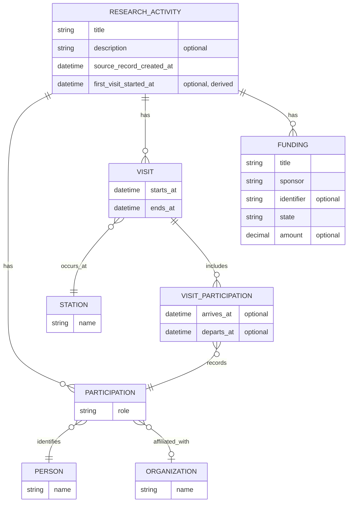

# FAIR Station research record: version 1

Status: working hypothesis for #32 

## Purpose

This document defines the initial **common domain model** for FAIR Station. It
is not a database schema or JSON Schema. The model must work independently of
RAMS and will change as we test real station workflows.

## Model overview



`ResearchActivity` is a coherent research endeavor. Source adapters produce
this model but are not part of the schema shown above.

| Concept | Meaning |
| --- | --- |
| `ResearchActivity` | The research being conducted |
| `Station` | A field station, reserve, or comparable host |
| `Person` | Someone participating in the research |
| `Participation` | A person's activity role and affiliation at that time |
| `Organization` | An institution associated with a participation |
| `Visit` | A bounded period for the activity at one station |
| `VisitParticipation` | Which activity participants joined a visit, with individual dates when supplied |
| `Funding` | A source-described application, award, contract, or other financial support |

### Relationship rules

- An activity may have many visits across many stations.
- Each visit has one host station in version 1.
- Activity participation does not imply visit attendance. Some participants
  may do lab, analysis, administrative, or other off-station work.
- Visit participants must also be activity participants.
- Relationships must be supplied by the source or mapper, not reconstructed by
  FAIR Station.

## Dates

Version 1 keeps two activity milestones:

- `source_record_created_at`: when the source record was created. This is not
  the start of the research.
- `first_visit_started_at`: the earliest qualifying visit start, derived from
  source-linked visit evidence.

Project-level dates do not replace visit dates. The first slice must define
which RAMS visit statuses count as having occurred; cancelled, denied,
incomplete, or future visits must not count silently.

## Funding

An activity may have many funding records. Version 1 maps the source-supported
title, sponsor, award or opportunity identifier, dates, amount, and state.

RAMS stores planned, submitted, funded, and denied states in several fields.
The RAMS mapper must define precedence and report contradictory combinations.
Missing amounts are not zero, sponsor labels are not reconciled organizations,
and submitted applications are not assumed to be awards.

## Initial RAMS mapping

Only RAMS projects with source type `Research` are included in the first slice.
Other RAMS project types may support future reporting, but they are not assumed
to be `ResearchActivity` records.

| RAMS | FAIR Station |
| --- | --- |
| Project | `ResearchActivity` |
| Project `created_at` | `source_record_created_at` |
| Project team membership | `Participation` |
| User | `Person` |
| Institution | `Organization` |
| Visit | `Visit` |
| Visit reserve | Visit's host `Station` |
| User visit | `VisitParticipation` |
| Funding | `Funding` |

RAMS projects can span multiple reserves through their visits. The optional
`Project#reserve` field is not mapped in version 1 because its domain meaning
has not been established.

RAMS's `first_reserve_visit_on_project?` checks whether another visit exists
for the same project and reserve. It is neither a project-wide first-visit date
nor proof of attendance, so it does not map directly to
`first_visit_started_at`.

## Source identity and provenance

Every imported activity retains an opaque source reference:

```json
{
  "source": "rams",
  "source_id": "projects/123"
}
```

The pair `(source, source_id)` identifies an import for idempotency. A FAIR
Station internal identifier is separate. Visits and funding retain source
identifiers when available; visit participation retains enough source linkage
to diagnose its origin. Derived values cite the facts used to produce them.

ORCID and ROR are public identifiers, not source references, and do not prove
that two records describe the same entity. Missing source data is not a
negative assertion.

## Version 1 validation slice

The version 1 model remains broader than its first executable increment. The
first end-to-end increment will:

1. read one RAMS research project with its creation time, team, visits, visit
   participants, and visit reserves;
2. map those records into the connected model above;
3. store or display the result and its two lifecycle milestones; and
4. preserve enough identity and evidence to repeat, update, and diagnose the
   import.

Funding remains in the version 1 working model but is not part of this first
executable increment. Its RAMS payload and precedence rules require a separate
validation increment.

We will also test the model against specific non-RAMS examples before treating
it as stable.

## Deferred and open

Version 1 does not define:

- database tables, a public API, or a complete JSON Schema;
- cross-source reconciliation or merging;
- visit operations such as reservations, approvals, amenities, permits,
  waivers, or invoicing;
- normalized funding sponsors, currencies, or statuses;
- controlled activity, participation-role, or status vocabularies;
- non-research activities such as classes, meetings, retreats, public use, or
  housing; or
- ORCID, ROR, or other enrichment.

The first slice must still validate which evidence establishes that a visit
occurred.

Future Survey123, Qualtrics, or Google Forms integrations may share a
platform-level connector while using station-specific mappings. That remains a
hypothesis until a second source reveals what can safely be shared.
